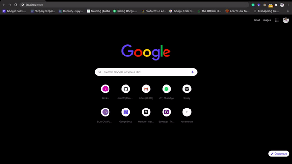
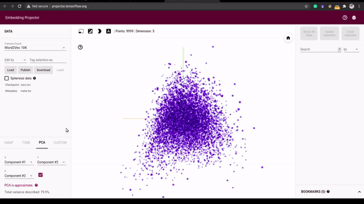

### Book Recommendation App Using Python TF-Keras and Javascript Tensorflow.js



The Book Recommender application is built using Tensorflow-Keras on book data from [Here](https://www.kaggle.com/zygmunt/goodbooks-10k).

The model uses embeddings to learn the mapping of books and users to ratings. This can help us identify similar books depending on the book and user interaction.

The [Python-Model](/Python-Model) folder contains all Python training files, including dataset, saved model, and embeddings which we visualized below, using the Tensorflow Projector.



The [recommender-books]() folder contains the web application. We first converted the saved model to Javascript format, and then embed it in the application.

To run the application, follow the steps below:

- Ensure you have Nodejs installed. If not follow the steps [here](https://nodejs.org/en/)
- Once you have node, clone the repo:

```bash
    git clone https://github.com/risenW/Tensorflowjs_Projects
    cd recommender-sys
```

- Change directory into the web app folder

```bash
    cd recommender-books
```

- Run the app:

```bash
    npm start
```
